# Data Sources

The bot pulls data from two external services.

## Teleport.io (Webcam)

[Teleport.io](https://teleport.io) provides live webcam streaming and historical footage.

### Feed Information

| Property    | Value                         |
| ----------- | ----------------------------- |
| Feed ID     | Verbier ski resort feed       |
| Location    | Verbier, Switzerland          |
| Update Rate | Real-time streaming           |
| Historical  | Available (date/time queries) |

### API Endpoints


### Usage in Bot

**Current Image:**

```javascript
const response = await fetch(`${TELEPORT_BASE}/feed/${feedId}/live`);
const imageBuffer = await response.buffer();
```

**Historical Image:**

```javascript
const timestamp = createVerbierDateTime(year, month, day, hour, minute);
const response = await fetch(`${TELEPORT_BASE}/feed/${feedId}/frame?t=${timestamp.toISOString()}`);
```

### Rate Limits

Teleport.io has reasonable rate limits for normal usage. The bot's usage pattern (a few requests per command) is well within limits.

---

## MeteoSwiss (Weather)

[MeteoSwiss Open Data](https://www.meteoswiss.admin.ch/services-and-publications/service/open-data.html) provides free weather data for Switzerland.

### Stations Used


| Station     | Code | Altitude | Purpose                   |
| ----------- | ---- | -------- | ------------------------- |
| Les Attelas | ATT  | 2734m    | Mountain/piste conditions |
| Montagnier  | MOB  | 839m     | Valley conditions         |

### Data Format

MeteoSwiss provides data as CSV with semicolon delimiters:

```csv
station;timestamp;tre200s0;fu3010z0;rre150z0;...
ATT;202401151000;-5.2;25.3;0.0;...
MOB;202401151000;3.1;10.5;0.0;...
```

### Weather Parameters

| Parameter     | Column     | Unit | Description               |
| ------------- | ---------- | ---- | ------------------------- |
| Temperature   | `tre200s0` | °C   | Air temperature at 2m     |
| Wind          | `fu3010z0` | km/h | Wind speed gust           |
| Precipitation | `rre150z0` | mm   | Precipitation last 10 min |

### Update Frequency

- **Interval:** Every 10 minutes
- **Availability:** Near real-time
- **Reliability:** Very high (government service)

### Weather Emoji Logic

```mermaid
flowchart TD
    start["Get Weather"] --> precip{"Precipitation > 0?"}
    precip -->|Yes| freeze{"Temp ≤ 0°C?"}
    freeze -->|Yes| snow["🌨️ Snow"]
    freeze -->|No| rain["🌧️ Rain"]
    precip -->|No| cold{"Temp ≤ -10°C?"}
    cold -->|Yes| freeze2["🥶 Freezing"]
    cold -->|No| cool{"Temp ≤ 0°C?"}
    cool -->|Yes| snowflake["❄️ Cold"]
    cool -->|No| hot{"Temp ≥ 25°C?"}
    hot -->|Yes| sun["☀️ Hot"]
    hot -->|No| mountain["⛰️ Default"]
```



### Usage in Bot

```javascript
const response = await fetch(CONFIG.meteoSwissUrl);
const csv = await response.text();
const lines = csv.trim().split('\n');

// Parse headers and find data lines
const headers = lines[0].split(';');
const tempCol = headers.indexOf('tre200s0');
const windCol = headers.indexOf('fu3010z0');

// Find station data
const attLine = lines.find(l => l.startsWith('ATT;'));
const values = attLine.split(';');
const temp = parseFloat(values[tempCol]);
```

---

## Data Reliability

### Fallback Handling


Both services are highly reliable, but the bot handles failures gracefully:

- **Teleport.io failure:** "Unable to fetch image. Please try again later."
- **MeteoSwiss failure:** Image sent without weather data
- **Both fail:** Generic error message

### Caching

Currently no caching is implemented. Each request fetches fresh data. For this use case (low request volume), this is acceptable and ensures data freshness.
