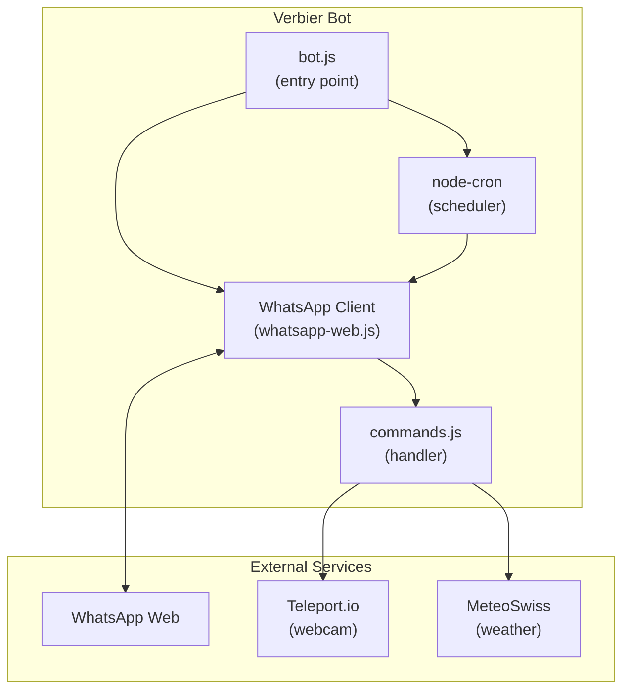
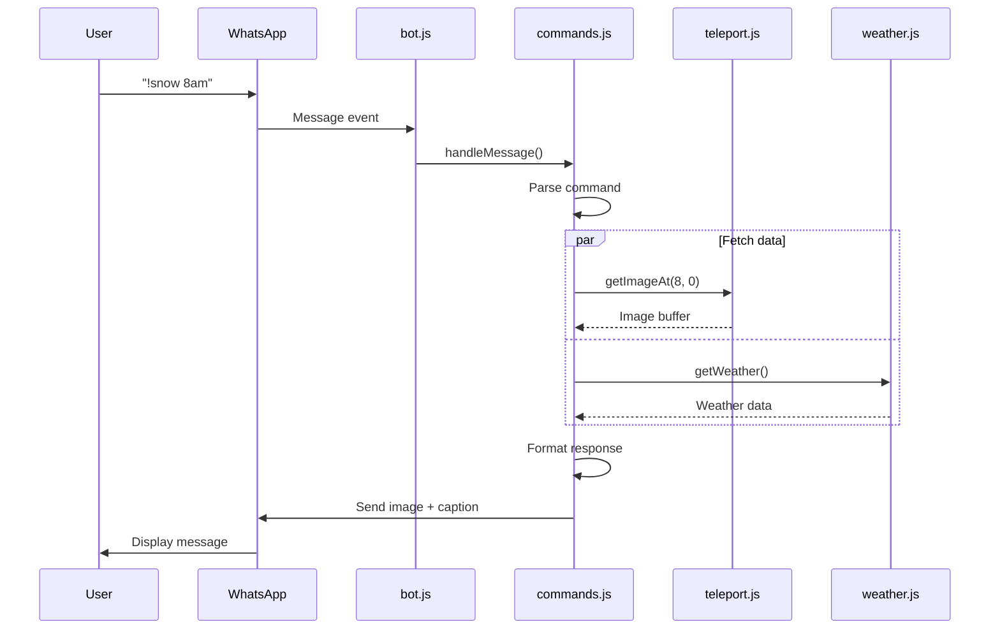
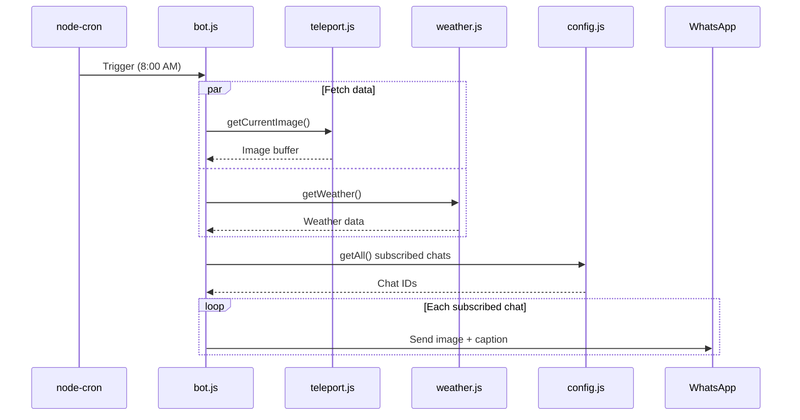
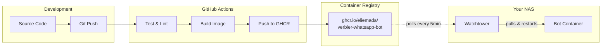

# Architecture Overview

How the Verbier WhatsApp bot works internally.

## System Diagram

## Core Components

### 1. WhatsApp Client (`bot.js`)

The entry point that:

- Initializes the WhatsApp Web client via Puppeteer
- Handles authentication (QR code generation)
- Sets up scheduled tasks
- Broadcasts messages to subscribed chats

### 2. Command Handler (`commands.js`)

Processes incoming messages:

- Pattern matching for commands (`!!`, `!snow`, `!verbier`)
- Time/date parsing for historical images
- Subscription management
- Error handling with user-friendly messages

### 3. Teleport Integration (`teleport.js`)

Fetches webcam images:

- Current live image endpoint
- Historical image retrieval with timestamp
- Returns raw image buffer

### 4. Weather Service (`weather.js`)

Fetches and formats weather data:

- Parses MeteoSwiss CSV data
- Extracts temperature, wind, precipitation
- Formats captions with emojis

### 5. Configuration (`config.js`)

Manages:

- Static configuration (feed ID, timezone, schedule)
- Chat subscription persistence (JSON file)

## Data Flow

### Incoming Message

### Scheduled Broadcast

## Technology Stack

| Component     | Technology                       |
| ------------- | -------------------------------- |
| Runtime       | Node.js 18+                      |
| Module System | ES Modules                       |
| WhatsApp      | whatsapp-web.js (Puppeteer)      |
| Scheduling    | node-cron                        |
| HTTP          | Native fetch API                 |
| Testing       | Vitest                           |
| Linting       | ESLint 9 + Prettier              |
| Container     | Docker (Node 24-slim + Chromium) |

## Deployment Architecture

## Key Design Decisions

### Why whatsapp-web.js?

- Full WhatsApp Web API access
- No official WhatsApp Business API needed
- Works with personal WhatsApp accounts
- Puppeteer provides reliable browser automation

### Why node-cron?

- Simple, reliable scheduling
- Timezone support (Europe/Zurich)
- No external dependencies

### Why ES Modules?

- Modern JavaScript standard
- Better tree shaking
- Native async/await support
- Cleaner import/export syntax

### Why JSON file for subscriptions?

- Simple persistence without database
- Easy to backup and restore
- Human-readable for debugging
- Sufficient for small-scale usage
