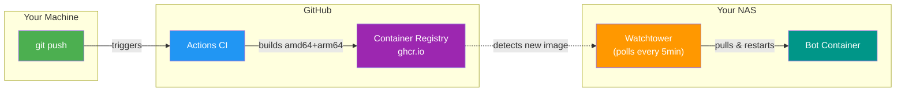

# Auto-Updates

Set up automatic deployments so pushing to GitHub deploys to your server.

## How It Works



1. You push code to `main`
2. GitHub Actions builds multi-arch Docker image
3. Image pushed to GitHub Container Registry
4. Watchtower detects new image (checks every 5 min)
5. Pulls new image, restarts container
6. Cleans up old image

**Result:** Zero-touch deployment.

## Watchtower Setup

Watchtower is included in the NAS compose files (`docker-compose.unraid.yml`, `docker-compose.nas.yml`).

### Configuration

```yaml
watchtower:
    image: containrrr/watchtower
    container_name: watchtower
    restart: unless-stopped
    volumes:
        - /var/run/docker.sock:/var/run/docker.sock
    environment:
        - WATCHTOWER_LABEL_ENABLE=true
        - WATCHTOWER_POLL_INTERVAL=300
        - WATCHTOWER_CLEANUP=true
        - WATCHTOWER_INCLUDE_STOPPED=true
        - WATCHTOWER_REVIVE_STOPPED=true
        - TZ=Europe/Zurich
```

### Environment Variables

| Variable                     | Value           | Description                           |
| ---------------------------- | --------------- | ------------------------------------- |
| `WATCHTOWER_LABEL_ENABLE`    | `true`          | Only update labeled containers        |
| `WATCHTOWER_POLL_INTERVAL`   | `300`           | Check every 5 minutes                 |
| `WATCHTOWER_CLEANUP`         | `true`          | Remove old images                     |
| `WATCHTOWER_INCLUDE_STOPPED` | `true`          | Update stopped containers             |
| `WATCHTOWER_REVIVE_STOPPED`  | `true`          | Start stopped containers after update |
| `TZ`                         | `Europe/Zurich` | Timezone for logs                     |

### Container Label

Containers must be labeled for Watchtower to update them:

```yaml
labels:
    - 'com.centurylinklabs.watchtower.enable=true'
```

## Verify Auto-Updates

### Check Watchtower Logs

```bash
docker logs watchtower
```

You should see:

```
time="2024-01-15T10:00:00Z" level=info msg="Checking for updates..."
time="2024-01-15T10:00:05Z" level=info msg="Found new image ghcr.io/eliemada/verbier-whatsapp-bot:latest"
time="2024-01-15T10:00:30Z" level=info msg="Stopping container verbier-whatsapp-bot"
time="2024-01-15T10:00:35Z" level=info msg="Starting container verbier-whatsapp-bot"
```

### Test an Update

1. Make a small change to the code
2. Push to `main`
3. Wait for GitHub Actions to complete (~2 min)
4. Wait for Watchtower poll (~5 min max)
5. Check your bot has the new code

## Notifications (Optional)

Get notified when Watchtower updates containers.

### Slack

```yaml
environment:
    - WATCHTOWER_NOTIFICATIONS=slack
    - WATCHTOWER_NOTIFICATION_SLACK_HOOK_URL=https://hooks.slack.com/services/xxx
```

### Email

```yaml
environment:
    - WATCHTOWER_NOTIFICATIONS=email
    - WATCHTOWER_NOTIFICATION_EMAIL_FROM=watchtower@example.com
    - WATCHTOWER_NOTIFICATION_EMAIL_TO=you@example.com
    - WATCHTOWER_NOTIFICATION_EMAIL_SERVER=smtp.example.com
    - WATCHTOWER_NOTIFICATION_EMAIL_SERVER_PORT=587
```

### Discord

```yaml
environment:
    - WATCHTOWER_NOTIFICATIONS=shoutrrr
    - WATCHTOWER_NOTIFICATION_URL=discord://token@webhookid
```

## Alternative: Portainer Webhooks

If you prefer not to use Watchtower:

1. Get webhook URL from Portainer (Container → Webhook)
2. Add secret `PORTAINER_WEBHOOK` to GitHub repo
3. Add to `.github/workflows/docker.yml`:

```yaml
- name: Deploy to Portainer
  if: github.ref == 'refs/heads/main'
  run: curl -X POST "${{ secrets.PORTAINER_WEBHOOK }}"
```

## Disable Auto-Updates

To disable auto-updates:

1. Remove the `watchtower` service from your compose file
2. Or remove the label from the bot container

The bot will then only update when you manually pull/recreate.
