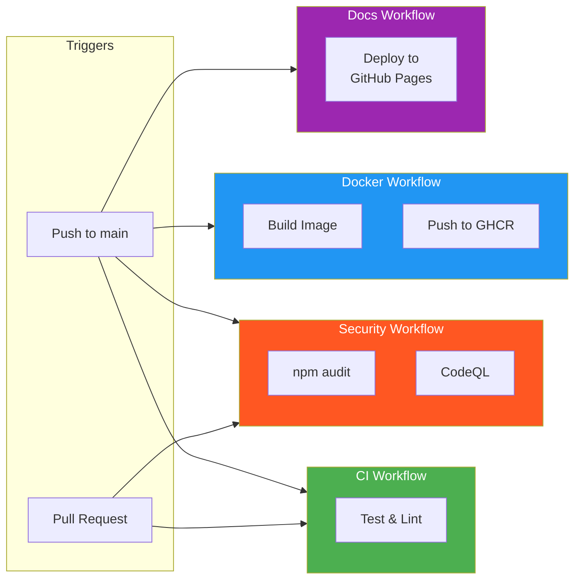
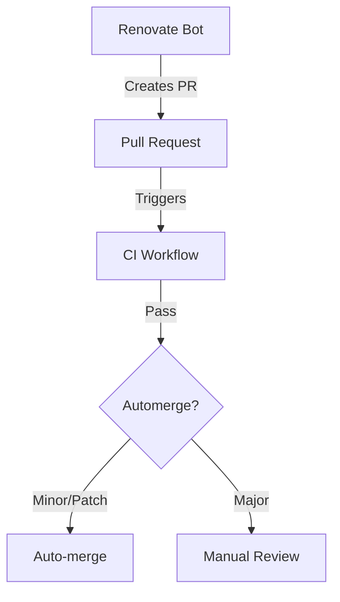
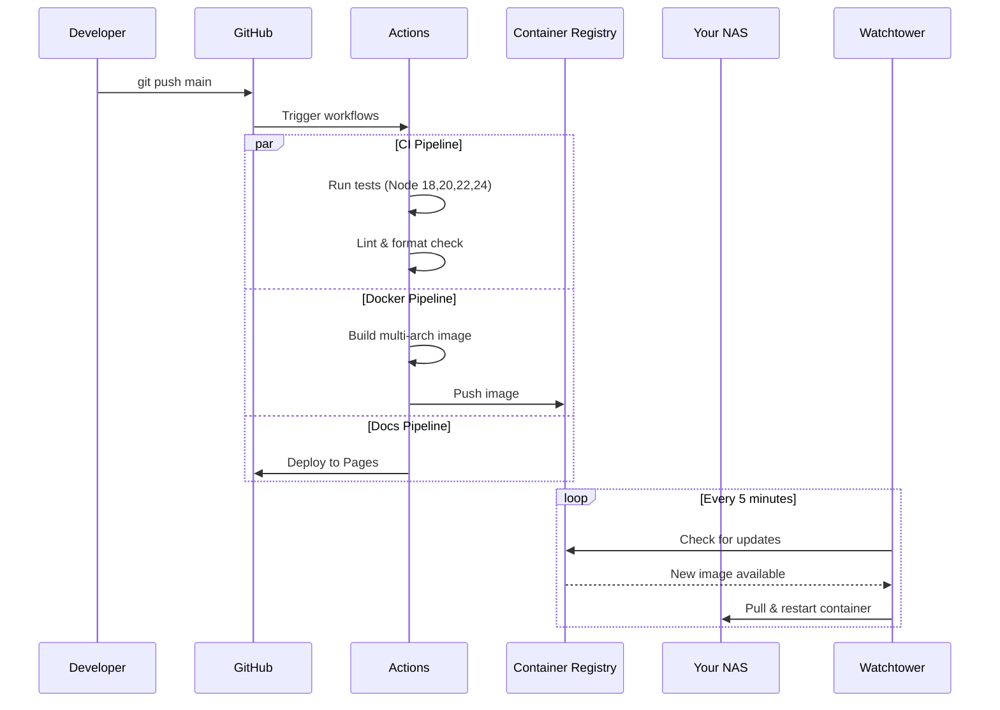

# CI/CD Pipeline

Automated testing, building, and deployment.

## Pipeline Overview



## Workflows

### CI (`ci.yml`)

Runs on every push and pull request.

**Jobs:**

- **Test** - Runs on Node.js 18, 20, 22, 24

**Steps:**

1. Checkout code
2. Setup Node.js with npm cache
3. Install dependencies (`npm ci`)
4. Run linter (`npm run lint`)
5. Check formatting (`npm run format:check`)
6. Run tests (`npm test`)

```yaml
strategy:
    matrix:
        node-version: [18, 20, 22, 24]
```

### Docker (`docker.yml`)

Runs on push to `main` only.

**Steps:**

1. Checkout code
2. Set up QEMU (for ARM builds)
3. Set up Docker Buildx
4. Log in to GitHub Container Registry
5. Build multi-arch image
6. Push to `ghcr.io/eliemada/verbier-whatsapp-bot`

**Tags:**

- `latest` - Always points to latest main
- `sha-abc123` - Specific commit SHA

**Platforms:**

- `linux/amd64` - Standard x86 servers
- `linux/arm64` - Raspberry Pi, Apple Silicon

### Security (`security.yml`)

Runs on push, pull request, and weekly schedule.

**Jobs:**

1. **Dependency Audit**
    - Runs `npm audit --audit-level=high`
    - Continues on error (non-blocking)

2. **CodeQL Analysis**
    - Static code analysis for JavaScript
    - Finds security vulnerabilities
    - Results in GitHub Security tab

### Docs (`docs.yml`)

Runs when docs change or manually triggered.

**Steps:**

1. Checkout code
2. Configure GitHub Pages
3. Upload `docs/` directory
4. Deploy to GitHub Pages

**URL:** `https://eliemada.github.io/verbier-whatsapp-bot/`

## Branch Protection

Recommended settings for `main` branch:

- ✅ Require status checks to pass
- ✅ Require branches to be up to date
- ✅ Required checks: `test (18)`, `test (20)`, `test (22)`, `test (24)`

## Secrets

No secrets required for public workflows. GitHub provides:

- `GITHUB_TOKEN` - Auto-generated, used for:
    - Pushing to GHCR
    - Deploying to GitHub Pages
    - Creating releases

## Renovate Integration



Dependency updates are automated:

- **Minor/Patch:** Auto-merged when CI passes
- **Major:** Requires manual approval

## Local CI Simulation

Run the same checks locally:

```bash
# Full CI check
npm run lint && npm run format:check && npm test

# Docker build test
docker build -t verbier-bot-test .
```

## Deployment Flow


