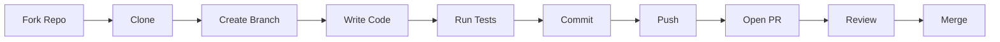

# Contributing

Guidelines for contributing to the Verbier WhatsApp Bot.

## Getting Started

1. Fork the repository
2. Clone your fork
3. Create a feature branch
4. Make your changes
5. Submit a pull request

```bash
# Clone your fork
git clone https://github.com/YOUR_USERNAME/verbier-whatsapp-bot.git
cd verbier-whatsapp-bot

# Create feature branch
git checkout -b feat/my-feature

# Install dependencies
npm install
```

## Development Workflow



## Code Style

### Formatting

Code is formatted with Prettier. Run before committing:

```bash
npm run format
```

Or let the pre-commit hook handle it automatically.

### Linting

ESLint enforces code quality:

```bash
npm run lint        # Check
npm run lint:fix    # Auto-fix
```

### Key Rules

- Use `const` by default, `let` when needed, never `var`
- Prefer template literals over string concatenation
- Use arrow functions for callbacks
- Strict equality (`===`) always
- Single quotes for strings
- Trailing commas

## Commit Messages

Use conventional commits with emoji prefixes:

| Prefix               | Usage         |
| -------------------- | ------------- |
| `:sparkles:`         | New feature   |
| `:bug:`              | Bug fix       |
| `:recycle:`          | Refactoring   |
| `:memo:`             | Documentation |
| `:white_check_mark:` | Tests         |
| `:wrench:`           | Configuration |
| `:arrow_up:`         | Dependencies  |
| `:whale:`            | Docker        |
| `:lock:`             | Security      |

**Examples:**

```bash
git commit -m ":sparkles: Add sunset image command"
git commit -m ":bug: Fix timezone offset in date parsing"
git commit -m ":memo: Update deployment docs"
```

## Pull Request Process

### Before Submitting

1. ✅ Tests pass: `npm test`
2. ✅ Linting passes: `npm run lint`
3. ✅ Formatting correct: `npm run format:check`
4. ✅ Commit messages follow convention
5. ✅ Branch is up to date with main

### PR Template

```markdown
## Summary

Brief description of changes.

## Changes

- Added X
- Fixed Y
- Updated Z

## Test Plan

- [ ] Tested locally
- [ ] Added unit tests
- [ ] Verified in Docker
```

### Review Checklist

- Code follows project style
- Tests cover new functionality
- Documentation updated if needed
- No security vulnerabilities introduced

## Adding Features

### New Command

1. Add handler in `src/commands.js`:

```javascript
async '!snow newcmd'(msg) {
    // Implementation
    await msg.reply('Response');
}
```

2. Add alias if needed:

```javascript
commands['!verbier newcmd'] = commands['!snow newcmd'];
```

3. Update help text
4. Add tests
5. Update documentation

### New Data Source

1. Create module in `src/`:

```javascript
// src/newservice.js
export async function getData() {
    const response = await fetch(URL);
    return response.json();
}
```

2. Add configuration in `src/config.js`
3. Integrate in commands
4. Add tests
5. Document in `docs/architecture/data-sources.md`

## Testing

### Writing Tests

```javascript
import { describe, it, expect } from 'vitest';
import { myFunction } from '../src/module.js';

describe('myFunction', () => {
    it('handles normal input', () => {
        expect(myFunction('input')).toBe('output');
    });

    it('handles edge cases', () => {
        expect(myFunction(null)).toBeNull();
    });
});
```

### Running Tests

```bash
npm test              # Run once
npm run test:watch    # Watch mode
npm run test:coverage # With coverage
```

## Documentation

### Updating Docs

Docs are in `docs/` directory using Docsify.

1. Edit markdown files
2. Preview locally:
    ```bash
    npx docsify serve docs
    ```
3. Commit changes
4. Auto-deployed on merge

### Adding Pages

1. Create `docs/path/page.md`
2. Add to `docs/_sidebar.md`
3. Link from related pages

## Questions?

- Open an issue for bugs or feature requests
- Check existing issues before creating new ones
- Be respectful and constructive
