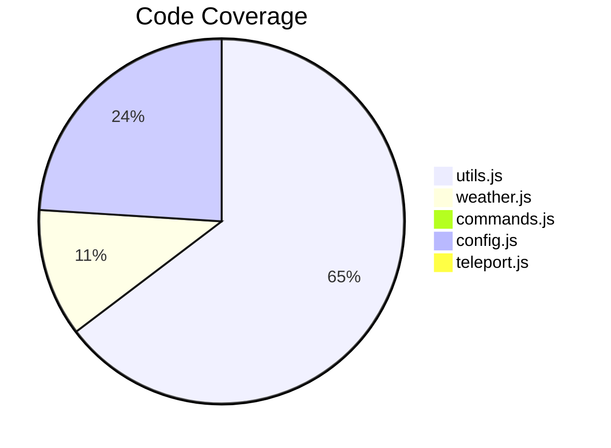

# Testing

The project uses [Vitest](https://vitest.dev/) for unit testing.

## Running Tests

```bash
# Run all tests once
npm test

# Watch mode (re-runs on file changes)
npm run test:watch

# With coverage report
npm run test:coverage
```

## Test Structure

```
tests/
├── utils.test.js      # Time/date parsing tests
└── weather.test.js    # Weather formatting tests
```

## Coverage Report

```bash
npm run test:coverage
```

Generates reports in `coverage/`:

- **Terminal:** Summary table
- **HTML:** `coverage/index.html` (detailed)
- **LCOV:** `coverage/lcov.info` (for CI tools)

### Current Coverage



| File        | Statements | Branches | Functions | Lines |
| ----------- | ---------- | -------- | --------- | ----- |
| utils.js    | 97%        | 97%      | 100%      | 100%  |
| weather.js  | 17%        | 17%      | 25%       | 20%   |
| commands.js | 0%         | 0%       | 0%        | 0%    |
| config.js   | 36%        | 40%      | 17%       | 36%   |

## Writing Tests

### Test File Convention

- Place tests in `tests/` directory
- Name files `*.test.js`
- Co-locate with source if preferred: `src/utils.test.js`

### Basic Test Structure

```javascript
import { describe, it, expect } from 'vitest';
import { myFunction } from '../src/myModule.js';

describe('myFunction', () => {
    it('does something', () => {
        expect(myFunction('input')).toBe('expected');
    });

    it('handles edge cases', () => {
        expect(myFunction(null)).toBeNull();
    });
});
```

### Example: Testing Time Parsing

```javascript
describe('parseTime', () => {
    describe('24-hour format', () => {
        it('parses hour only', () => {
            expect(parseTime('15')).toEqual({
                hour: 15,
                minute: 0,
                label: '3 PM',
            });
        });

        it('parses HH:MM format', () => {
            expect(parseTime('15:30')).toEqual({
                hour: 15,
                minute: 30,
                label: '3:30 PM',
            });
        });
    });

    describe('edge cases', () => {
        it('returns null for invalid input', () => {
            expect(parseTime(null)).toBeNull();
            expect(parseTime('')).toBeNull();
            expect(parseTime('25:00')).toBeNull();
        });
    });
});
```

## Testing Best Practices

### Do

- Test pure functions (utils, formatting)
- Test edge cases and error conditions
- Use descriptive test names
- Group related tests with `describe`

### Don't

- Mock external services excessively
- Test implementation details
- Write flaky tests that depend on timing

## Configuration

Vitest is configured in `vitest.config.js`:

```javascript
import { defineConfig } from 'vitest/config';

export default defineConfig({
    test: {
        coverage: {
            provider: 'v8',
            include: ['src/**/*.js'],
            exclude: ['src/logger.js'],
            reporter: ['text', 'html', 'lcov'],
        },
    },
});
```

## CI Integration

Tests run automatically on:

- Every push to `main`
- Every pull request

See [CI/CD Pipeline](cicd.md) for details.
